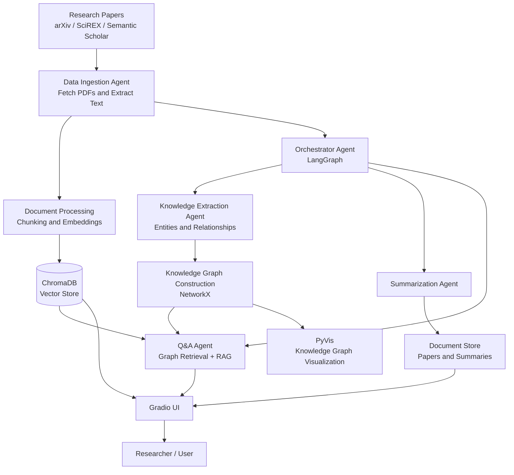

## High-Level Architecture

```mermaid
flowchart TD
    A[Research Papers<br/>arXiv / SciREX / Semantic Scholar]
    B[Data Ingestion Agent<br/>Fetch PDFs and Extract Text]
    C[Document Processing<br/>Chunking and Embeddings]
    D[(ChromaDB<br/>Vector Store)]
    E[Orchestrator Agent<br/>LangGraph]
    F[Knowledge Extraction Agent<br/>Entities and Relationships]
    G[Knowledge Graph Construction<br/>NetworkX]
    H[Summarization Agent]
    I[Q&A Agent<br/>Graph Retrieval + RAG]
    J[Document Store<br/>Papers and Summaries]
    K[Gradio UI]
    L[PyVis<br/>Knowledge Graph Visualization]
    M[Researcher / User]

    A --> B --> C
    C --> D
    B --> E
    E --> F --> G
    E --> H --> J
    E --> I
    D --> I
    G --> I
    D --> K
    J --> K
    G --> L
    I --> K
    K --> M
```
